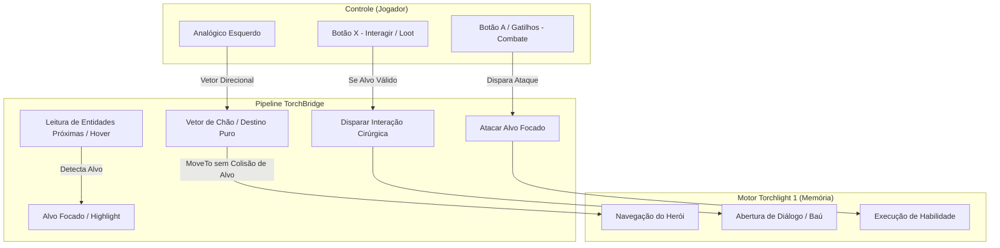

# Arquitetura e Engenharia Reversa: Movimentação e Interação Nativa de Console (Torchlight 1)

> **Documento de Especificação Técnica e Roteiro de Pesquisa**  
> **Objetivo:** Desacoplar a movimentação do personagem do sistema de combate/interação do mouse do Torchlight 1, eliminando cliques acidentais em NPCs, baús e monstros, alcançando a experiência fluida e nativa de console (Xbox 360).

---

## 1. O Problema Fundamental: A Sobrecarga do Clique Esquerdo

No Torchlight 1 para PC, o botão esquerdo do mouse (`Left Click`) é polimórfico e sobrecarregado pela engine original:

| Alvo Sob o Cursor | Ação Disparada pelo Jogo | Consequência no Analógico |
| :--- | :--- | :--- |
| **Terreno Livre (Chão)** | `MOVE_TO_POSITION` | Personagem anda normalmente na direção desejada. |
| **Monstro / Inimigo** | `SET_TARGET` + `DEFAULT_ATTACK` | **Trava o personagem no lugar** para atacar; no meio de uma horda, o jogador fica encurralado e morre. |
| **NPC com Diálogo** | `OPEN_DIALOG` / `TALK` | **Abre janela de conversa**, interrompe a corrida e toma o controle da UI. |
| **Baú / Barril / Portal** | `INTERACT` / `LOOT` | Desvia a rota para abrir o objeto ou carregar uma nova área por engano. |

### Por que heurísticas simples de mouse falham:
1. **Vetor Curto (40–60px nos pés):**
   * Reduz cliques em objetos distantes, mas falha totalmente quando colado em NPCs ou cercado de monstros (as cápsulas de colisão 3D dos inimigos cobrem o chão ao redor do herói).
   * Valores abaixo de 40px causam *jitter* / engasgos na física de virada do personagem.
2. **Auto-Cancel com ESC:**
   * Funciona para fechar caixas de diálogo de NPCs, mas **não tem efeito contra monstros**, pois golpear um monstro não abre menu cancelável; simplesmente inicia animação de ataque.
3. **Soltar o Clique ao Passar por Cima:**
   * Soltar o botão esquerdo enquanto o analógico está inclinado age como um "freio de mão", fazendo o herói mancar ou parar na hora.

---

## 2. A Solução Nativa: Como o Console (Xbox 360) Faz

No porte oficial de Torchlight para Xbox 360, a Runic Games reconstruiu o subsistema de entrada:
* **Analógico Esquerdo:** Aplica diretamente um vetor de velocidade/deslocamento no `CPlayer` (`m_velocity` ou `m_destination`). **Nenhum clique de mouse virtual existe na movimentação.**
* **Sistema de Targeting / Foco:** O motor calcula a entidade interativa mais próxima no cone de visão do personagem e exibe um contorno (*highlight*) com um prompt do botão (ex: `(X) Conversar`, `(A) Atacar`).
* **Botões de Ação:** O clique de interação ou ataque é despachado **estritamente** quando os botões físicos correspondentes são pressionados.



---

## 3. Topologia da Memória do Jogo (Offsets e Estruturas)

Graças ao trabalho já concluído no [memory.py](file:///c:/Users/kleve/Documents/Projetos/TorchBridge/src/torchbridge/memory.py), a cadeia de navegação estática do Torchlight 1 (GOG e Steam) já está estabelecida:

```
[Módulo Base] 
      │
      ▼
   CGame (GOG: 0x00C1AD64 | Steam: Base + 0x007F0E0C)
      │
      ├──> +0x64: CGameClient
      │      │
      │      ├──> +0x2C: CPlayer (Ponteiro do Herói Local)
      │      ├──> +0x38: CLevel (Ponteiro do Mundo / Nível Atual)
      │      └──> +0x3C: CGameUI (Árvore de Interfaces - Já Mapeada!)
```

### O que precisamos mapear no `CPlayer` e `CGameClient`:

Para o desacoplamento completo, a pesquisa em memória focará nos seguintes campos:

| Objeto / Classe | Offset Estimado | Tipo | Propósito |
| :--- | :--- | :--- | :--- |
| `CGameClient` | `+0x??` | `void*` (`m_pHoverObject`) | Ponteiro da entidade atualmente sob o cursor do mouse no raycast do frame. |
| `CPlayer` | `+0x??` | `float[3]` (`Vector3`) | Posição no mundo do jogador $(X, Y, Z)$. |
| `CPlayer` | `+0x??` | `float[3]` (`Vector3`) | Posição de destino da movimentação atual $(DestX, DestY, DestZ)$. |
| `CPlayer` | `+0x??` | `void*` (`m_pTarget`) | Ponteiro do alvo atual travado para ataque/conversa (`0` = nenhum alvo). |
| `CPlayer` | `+0x??` | `uint32` (`m_actionState`) | Enum de estado da ação (`IDLE = 0`, `WALK = 1`, `ATTACK = 2`, etc.). |
| `CLevel` | `+0x??` | `std::vector` / lista | Lista de entidades vivas no mapa (NPCs, monstros, baús). |

---

## 4. As Duas Estratégias de Implementação Técnica

### Estratégia 1: O "Raycast Seguro com Limpeza de Alvo" (Zero DLL Injection)
Esta estratégia usa o pipeline de entrada do Windows (`SendInput`) combinado com leitura e escrita cirúrgica em memória, sem precisar injetar código executável (DLL/ASM):

1. **Movimento pelo Analógico:**
   * O analógico calcula o vetor em direção ao horizonte livre (além da horda de monstros ou num raio seguro de chão).
   * O `SendInput` envia o clique de movimentação.
2. **Neutralização do Alvo em Tempo Real:**
   * Se o analógico estiver ativo e o jogo tentar travar um monstro ou NPC no `m_pTarget` do jogador sem que o botão de ataque/interação tenha sido apertado:
   * O `memory.py` zera o ponteiro: `write_u32(p_player + OFFSET_TARGET, 0)`.
   * **Efeito no Jogo:** O motor aborta imediatamente a ordem de ataque/diálogo e força a máquina de estados a continuar na rota de caminhada (`MOVE_TO`).

### Estratégia 2: Movimentação Direta por Coordenada de Destino (Injeção de Vetor 3D)
Esta é a experiência mais pura de console:

1. A cada tick do analógico (120 Hz):
   * Lemos a posição atual $(X, Y, Z)$ do herói em `CPlayer`.
   * Projetamos o destino $(X + \cos\theta \cdot R, Y, Z + \sin\theta \cdot R)$ no plano do mundo.
   * Escrevemos as coordenadas de destino diretamente em `m_destination` ou chamamos a função nativa `CPlayer::MoveTo`.
2. **Resultado:**
   * **Zero cliques de mouse virtuais** para andar.
   * O mouse fica 100% parado ou reservado exclusivamente para os menus e mira manual do analógico direito.

---

## 5. Arquitetura da Interação Contextual (Botão X)

Com a movimentação protegida de cliques involuntários, a interação segue o padrão de console:

```mermaid
sequenceDiagram
    participant Jogador as Jogador (Controle)
    participant Overlay as TorchBridge Overlay
    participant Memoria as Torchlight Memory (RAM)
    participant Motor as Torchlight Engine

    Note over Memoria,Overlay: Varredura de Proximidade (120 Hz)
    Memoria->>Overlay: Entidade Próxima Detectada (ex: Syl, Duran, Baú)
    Overlay->>Jogador: Desenha Ícone [X] flutuando sobre o alvo

    alt Jogador apenas anda ao redor
        Jogador->>Motor: Analógico inclinado (Movimentação Pura)
        Motor-->>Motor: Ignora interação; Herói continua andando
    else Jogador decide interagir
        Jogador->>Overlay: Pressiona [X]
        Overlay->>Memoria: Lê coordenadas exatas da tela do alvo
        Overlay->>Motor: Dispara clique esquerdo sobre a entidade
        Motor->>Jogador: Abre janela de diálogo / Abre baú
    end
```

---

## 6. Roteiro Prático para o Dia da Execução

Quando formos colocar a mão na massa, o plano de ataque será dividido em 4 etapas claras:

### Etapa 1: Sondagem de Offsets no Cheat Engine / x64dbg
* [ ] Conectar ao `Torchlight.exe` (Steam ou GOG).
* [ ] Acessar `CPlayer` (`[[CGame] + 0x64] + 0x2C`).
* [ ] Localizar as coordenadas $X, Y, Z$ do personagem (varredura de floats que mudam ao andar).
* [ ] Localizar o ponteiro `m_pTarget` (ponteiro que fica `0x00000000` ao andar no chão limpo e vira um ponteiro não-nulo ao clicar em um NPC ou monstro).
* [ ] Localizar `m_pHoverObject` em `CGameClient` (atualizado a cada frame conforme o mouse passa sobre entidades).

### Etapa 2: Mapeamento no `memory.py`
* [ ] Adicionar `read_player_position()` e `read_player_target()`.
* [ ] Adicionar suporte a escrita segura com `WriteProcessMemory` (`PROCESS_VM_WRITE | PROCESS_VM_OPERATION`).
* [ ] Validar compatibilidade dos offsets tanto na versão GOG quanto na versão Steam.

### Etapa 3: Integração no `engine.py`
* [ ] Criar o manipulador de movimentação desacoplada: suprimir `LBUTTONDOWN` sobre entidades durante a navegação do analógico esquerdo.
* [ ] Implementar a trava de foco do botão `X` (interação só despacha comando com alvo válido e botão pressionado).
* [ ] Desacoplar habilidades de combate para disparar nos alvos focados sem interferir na caminhada.

### Etapa 4: Indicadores Visuais no `overlay.py`
* [ ] Renderizar um sprite sutil de contorno ou ícone `[X]` sobre a cabeça do NPC ou objeto focado.
* [ ] Sincronizar o desaparecimento do ícone assim que a entidade sair do raio de alcance.
